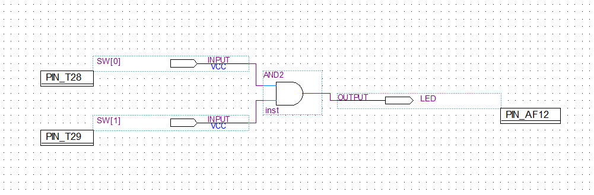
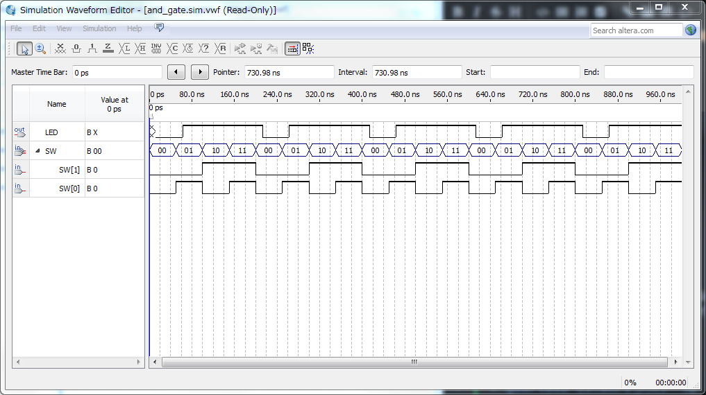

## 1. 目的
### 1.1. 目的
andゲートのシミュレーションとしくみの理解。

### 1.2. 真理値表
andゲートの真理値表を表1に示す。

表1 andゲートの真理値表

| sw0(input) | sw1(input) | led(output) |
| ----------: | ----------: | -----------: |
| 0          | 0          | 0           |
| 0          | 1          | 0           |
| 1          | 0          | 0           |
| 1          | 1          | 1           |

## 2. 設計について
実験書通りに実装した。
作成した論理回路図を図1に示す。

図1 作成した論理回路図

## 3. 動作確認について
### 3.1. シミュレーション
シミュレーション結果を図2に示す。

図2 タイミングチャート

### 3.2. altera上での確認
alteraに書き込んでプッシュスイッチky0とky1をinput、7セグledの右端のドットをoutputとして動作確認をした。

## 4. 評価・考察・工夫したこと
### 4.1. 評価
今回の実験の評価は以下の通りである。
* 簡単に論理回路を実装できることを確認

----

### 4.2. 考察
今回の実験の考察は以下の通りである。
* コンパイルして出力されるファイル名はプロジェクト名であり、回路図が書かれているファイル名ではなさそう
  * `and_gate`というファイルとnotゲートを追加した`nand_gate`というファイルを用意してentryを変更してコンパイルしても`and_gate`(こっちはプロジェクト名)として出力された

----

### 4.3. 工夫
今回の実験の工夫は以下の通りである。
* 結線の状態を確認するためにすこしずらして配置
* andの入出力が負論理だったため、それぞれにnotゲートを追加したファイルを作成し、altera上での動作を正論理にした
* notゲートを追加したファイルとシミュレーション用のファイルを分けて管理できるようにした

----

## 5. 感想
今回の実験の感想は以下の通りである。
* コンパイル周りにややクセのあるソフトウェアだなと思った
  * 差分コンパイルだと動作しなかったりする
